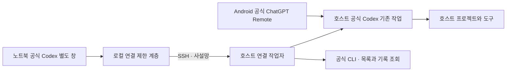

# 앱 개요

Codex Session Bridge는 한 Windows PC의 기존 공식 Codex 작업을 다른 Windows PC의 공식 Codex 화면에서 사용하는 연결 도구입니다. GPU는 필수 하드웨어가 아닙니다. 코딩 도구와 프로젝트가 있는 PC를 호스트로 사용하면 됩니다.

## 구성

노트북의 별도 Codex 프로필은 연결 전용입니다. 일반 Codex 창과 다른 사용자 데이터 폴더를 사용합니다. 목록과 본문은 호스트에서 읽고, 입력은 원래 작업의 소유자에게 전달합니다. 작업 ID를 유지하며, 호스트 파일을 노트북 작업 폴더로 복제하지 않습니다.

## 성능과 연결

작업 본문을 제한된 메모리에 미리 읽고 최근 작업을 잠시 유지하여 전환 지연을 줄입니다. 사전 읽은 본문이 보여도 원래 호스트 작업과의 연결이 확인되기 전에는 입력할 수 없습니다. 실시간 상태에 포함되지 않은 긴 대화의 이전 턴은 공식 `thread/turns/list` 읽기 API로 페이지 단위 조회하며, 이 조회는 작업을 실행하거나 소유하지 않습니다. 네트워크 지연, 첫 연결, 매우 긴 작업의 로딩 시간은 남을 수 있습니다.

SSH가 끊기면 조회 연결을 다시 시도합니다. 작업 소유자가 바뀌면 차단하며, 사용자의 입력·승인 처리 결과가 불확실하면 자동으로 재전송하지 않습니다.

## 저장 위치

| 위치 | 내용 |
|---|---|
| `%LOCALAPPDATA%\Programs\CodexSessionBridge\versions` | 버전별 프로그램과 포함된 런타임 |
| `%LOCALAPPDATA%\CodexSessionBridge\clients\<ID>` | 연결 설정, 해당 호스트 SSH 지문, 최근 작업, 진단 보고서 |
| `%LOCALAPPDATA%\CodexSessionBridge\selected.json` | 현재 선택한 연결 ID |
| `%LOCALAPPDATA%\CodexSessionBridge\host.json` | 호스트에서 사용할 설치 경로 |
| `%TEMP%\codex-gpu-guard-*` | 연결용 공식 앱의 별도 프로필 |
| 호스트 `%LOCALAPPDATA%\CodexSessionBridge`의 journal 폴더 | 입력·생성·승인 중복 방지 기록 |

연결 설정에는 암호나 SSH 개인 키 본문을 저장하지 않습니다. 개인 키를 지정하면 경로만 기록합니다. 진단 보고서와 임시 앱 프로필에는 작업 식별자·제목·경로·캐시가 포함될 수 있으므로 공개 이슈에 그대로 첨부하지 마세요.

## 호환성 원칙

이 도구는 공개 App Server API뿐 아니라 공식 앱의 비공개 IPC에도 의존합니다. 따라서 OS만 같다고 모든 Codex 버전에서 동작하지 않습니다. 검증하지 않은 버전은 차단하며, 업데이트 후 검증을 거쳐 새 배포본에서 추가합니다. 앱 자체를 재배포하거나 수정하지 않습니다.
